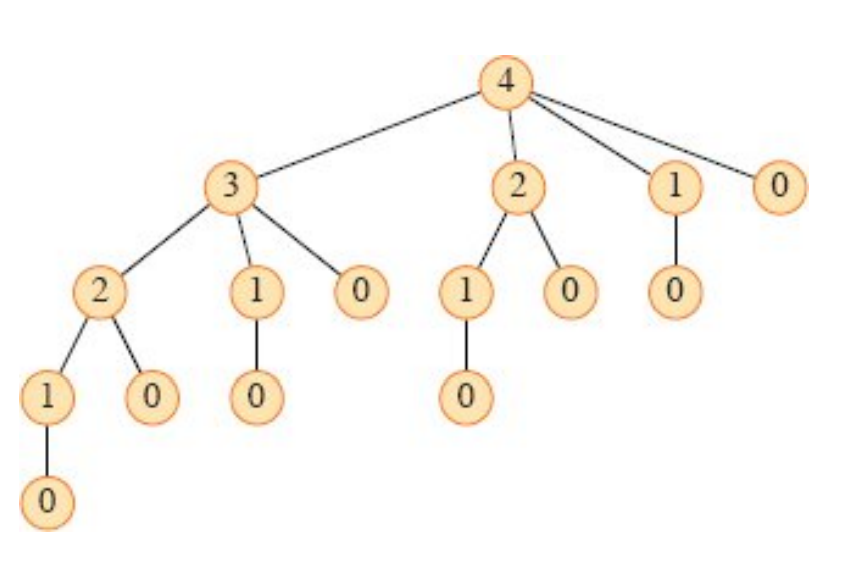
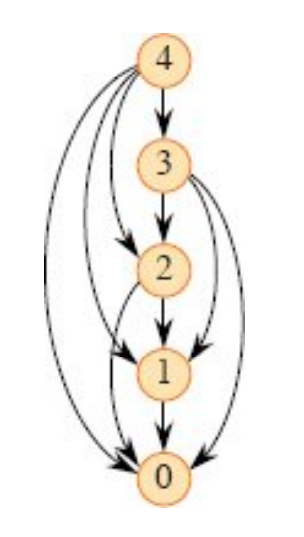
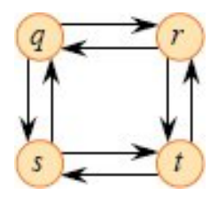
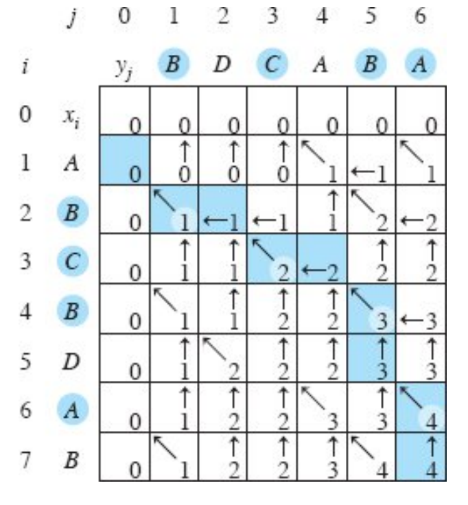
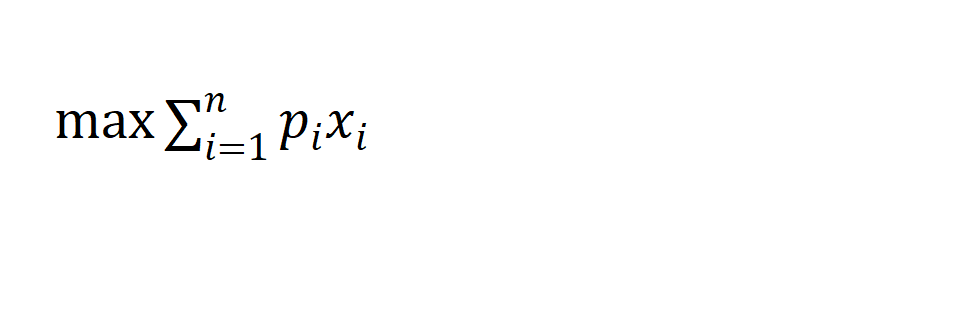

# 第十五章  动态规划
<font size=5>一、问题导入：钢条切割</font>  
<font size=4>1.问题形容</font>  
<font size=4>给定一段长度为n的钢条和一个价格表p<sub>i</sub>(i=1,2,...,n)，求切割钢条方案，使得销售收益最大</font>   
  
<font size=4>2.问题分析</font>  
<font size=4>(1)长度为n的钢条有2<sup>n-1</sup>种不同的切割方案</font>  
<font size=4>(2)最优切割方案：n=i<sub>1</sub>+i<sub>2</sub>+...+i<sub>k</sub>(最优切成k段)</font>  
<font size=4>(3)最大收益：r<sub>n</sub>=p<sub>i<sub>1</sub></sub>+p<sub>i<sub>2</sub></sub>+...+p<sub>i<sub>n</sub></sub></font>  
<font size=4>(4)一般形式：r<sub>n</sub>=$\underset{}{max}$(p<sub>n</sub>,r<sub>1</sub>+r<sub>n-1</sub>,r<sub>2</sub>+r<sub>n-2</sub>,...,r<sub>n-1</sub>+r<sub>1</sub>)</font>  
<font size=4>PS:当完成首次切割后，将两段钢条看成独立的钢条切割问题实例</font>  
<font size=4>(5)最优子结构：问题的最优解由相关子问题的最优解组合而成，这些子问题可以独立求解</font>  
<font size=4>PS:保持子问题空间尽可能简单，只有在必要时才扩展</font>  
<font size=4>(6)更简单的递归方案：r<sub>n</sub>=$\underset{1≤i≤n}{max}$(p<sub>i</sub>+r<sub>n-i</sub>)</font>  
<font size=4>3.普通递归实现</font>      
<font size=4>(1)伪代码</font>  
```
CUT-ROD(p,n)
if n == 0
    return 0
q = -∞
for i = 1 to n
    q = max(q,p[i]+CUT-ROD(p,n-i))
return q
```  
<font size=4>(2)存在的问题</font>  
<font size=4>①每当将n增大1，程序运行时间几乎增加1倍</font>  
<font size=4>②运行时间：</font>  
<font size=4>T(n)=1+$\displaystyle \sum^{n-1}_{j=0}{T(j)}$</font>  
<font size=4>"1"表示函数的第一次调用，T(j)表示调用CUT-ROD(p,n-i)所产生的所有调用(包括递归调用,j=n-i)</font>  
<font size=5><mark>Q1:证明T(n)=2<sup>n<sup><mark></font>  
<font size=4>4.动态规划实现</font>  
<font size=4>(1)普通递归的问题</font>  
<font size=4>观察下面的递归调用树</font>  
  
<font size=4><font color=red>反复求解相同的子问题！！！</font></font>  
<font size=4>(2)带备忘的自顶向下的递归调用</font>  
<font size=4>①此方法仍按自然的递归形式书写代码，但将每一个子问题的解保存到一个数组或散列表中</font>  
<font size=4>②每当求解一个子问题时，先检查是否求解过此问题，如果解过，则直接返回这个子问题的解</font>  
<font size=4>③该方法的伪代码</font>  
```
MEMOIZED-CUT-ROD(p, n)
let r[0 : n] be a new array 
for i = 0 to n
    r[i] = −∞
return MEMOIZED-CUT-ROD-AUX(p, n, r)
MEMOIZED-CUT-ROD-AUX(p, n, r)
if r[n] ≥ 0 
    return r[n]//先检查所需要的值是否已求，如果是，就直接返回
if n == 0
    q = 0
else q = −∞
    for i = 1 to n 
        q = max(q, p[i] + MEMOIZED-CUT-ROD-AUX(p, n − i, r))
r[n] = q 
return q
```
<font size=4>(3)自底向上的迭代调用</font>  
<font size=4>①前提：任何子问题的求解只依赖于更小的子问题</font>  
<font size=4>②将子问题按规模排序，从小到大按顺序求解</font>  
<font size=4>③在求解某一子问题时，由于其依赖更小的子问题进行求解，而更小的子问题已经求解过了，故可以直接进行求解</font>  
<font size=4>④该方法伪代码</font>  
```
BOTTOM-UP-CUT-ROD(p, n)
let r[0 : n] be a new array //保存子问题的解
r[0] = 0
for j = 1 to n
    q = −∞
    for i = 1 to j 
        q = max {q, p[i] + r[j − i]}//直接访问r[j-i]获得规模j-i的子问题的解
    r[j] = q // remember the solution value for length j
return r[n]
```
<font size=4>(4)两种方法的运行时间</font>  
<font size=4>①自底向上的迭代调用：两个for循环构成等差数列，易得其运行时间为Θ(n<sup>2</sup>)</font>  
<font size=4>②带备忘的自顶向下的递归调用：对每个子问题只求解一次，而一共有规模0~n的子问题，而求解规模0,1,...,n的子问题时，有0,1,...,n次循环，故该方法的循环执行次数也是等差数列，故运行时间为Θ(n<sup>2</sup>)</font>  
<font size=4>③可以用子问题的总数和每个子问题需要考察的选择数来粗略分析动态规划算法的运行时间</font>  
<font size=4>a.对于钢条切割问题，共有Θ(n)个子问题，每个子问题最多有n种选择，故运行时间为O(n<sup>2</sup>)</font>  
<font size=4>b.子问题图</font>  
<font size=4>①子问题图表达了涉及的子问题和子问题之间的依赖关系</font>  
<font size=4>②子问题图是一个有向图，每个顶点对应一个子问题，每条有向边对应一个关系，如果子问题x在求解时直接使用了子问题y，在图中就有一个从x到y的子问题图</font>  
<font size=4>③子问题图对运行时间的大致分析：顶点数×有向边数</font>  
<font size=4>在钢条切割的子问题图中，一共有n个顶点，每个顶点最多有n条边，所以运行时间是O(n<sup>2</sup>)</font>  
  

<font size=5><mark>Q2:两种方法哪个更好，好在哪？<mark></font>  
<font size=4>5.重构解</font>  
<font size=4>(1)若我们不仅需要最优解的收益值，还要知道这个解本身，我们就需要重构解</font>  
<font size=4>(2)我们可以扩展动态规划算法，使每个子问题不仅保存最优收益值，还保存对应的切割方案</font>  
<font size=4>(3)扩展版本的伪代码</font>  
```
EXTENDED-BOTTOM-UP-CUT-ROD(p, n)
let r[0 : n] and s[1 : n] be new arrays
r[0] = 0
for j = 1 to n
    q = −∞
    for i = 1 to j
        if q < p[i] + r[j − i]
            q = p[i] + r[j − i]
            s[j] = i //将最优切割长度i保存在s[j]中
    r[j] = q
return r and s
```
<font size=5>PS：子问题无关</font>  

<font size=4>(1)无权最短路径和无权最长路径：一条从u到v边数最少的路径就是无权最短路径(一个无权最短路径一定是简单路径)，一条从u到v边数最多的简单路径就是无权最长路径</font>  
<font size=4>(2)无权最短路径具有最优子结构：如果u到v的任意路径p包含一个中间节点w，那么u~v的最短路径可分解为u~w的最短路径和w到v的最短路径，可用"剪切-粘贴"法证明</font>  
<font size=4>(3)"剪切-粘贴"法：利用反证法，假定子问题的解不是其自身的最优解，就把子问题的解剪切掉，粘贴最优解，从而得到一个更优的解，与最初的解是原问题的最优解矛盾</font>  
<font size=4>(4)无权最长路径不存在最优子结构</font>  
<font size=4>举例分析：从q到r的最长路径是q→s→t→r，从r到t的最长路径是r→q→s→t，而组合它们得到的"最长路径"是q→s→t→r→q→s→t，<font color=red>甚至不是一个合法的最长路径！！！</font></font>  
  
<font size=4>(5)问题所在：最短路径问题和最长路径问题都涉及了子问题，但最短路径问题的子问题是无关的，而最长路径问题的子问题是相关的</font>  
<font size=4>(6)子问题无关：同一个子问题的解不影响另一个子问题的解</font>  
<font size=4>(7)在最长路径问题中，顶点会重复使用，并且不可不使用，所以最长路径的子问题必然相关</font>  
<font size=4>PS:最长路径问题是NP完全的</font>  
<font size=4>(8)最短路径问题的子问题间是不共享资源的，如果u到v的最短路径中存在一个顶点w，除了w之外没有任何一个顶点同时出现在两个子路径上</font>  
<font size=4>使用反证法证明：假设存在一个同时出现在两条路径上的点x，u~w可分解为u~x~w，w~v可分解为w~x~v，假设u~v一共有n条边，，我们再构造一条u~x~v，因为减少了两条路径，因此边数为n-2，又因为n为最短路径数，前后矛盾，所以最短子路径之间是无关的</font>  
<font size=4>(9)在钢条切割问题中，长度为n的问题的最优解只包括一个子问题的解，所以子问题显然无关</font>  
<font size=5>二、实例应用：最长公共子序列</font>  
<font size=4>1.问题描述</font>  
<font size=4>(1)子序列：给定一个序列X=(x<sub>1</sub>,x<sub>2</sub>,...,x<sub>m</sub>)，另一个序列Z=(z<sub>1</sub>,z<sub>2</sub>,...,z<sub>k</sub>)满足如下条件时称为X的子序列，即存在一个严格递增的X的下标序列(i<sub>1</sub>,i<sub>2</sub>,...,i<sub>k</sub>)，对所有j=1,2,...,k，满足x<sub>i<sub>j</sub></sub>=z<sub>j<sub></font>  
<font size=4>(2)公共子序列：给定两个序列X和Y，如果Z既是X的子序列又是Y的子序列，我们称它是X和Y的公共子序列</font>  
<font size=4>(3)最长公共子序列问题(LCS问题)：给定两个序列X=(x<sub>1</sub>,x<sub>2</sub>,...,x<sub>m</sub>)和Y=(y<sub>1</sub>,y<sub>2</sub>,...,y<sub>n</sub>),求X和Y的最长公共子序列</font>  
<font size=4>2.递归公式</font>  
<font size=4>(1)前缀：给定一个序列X=(x<sub>1</sub>,x<sub>2</sub>,...,x<sub>m</sub>)，对i=0,1,...,m，定义X的第i前缀为X<sub>i</sub>=(x<sub>1</sub>,x<sub>2</sub>,...,x<sub>i</sub>)</font>  
<font size=4>(2)LCS的最优子结构：令X=(x<sub>1</sub>,x<sub>2</sub>,...,x<sub>m</sub>)和Y=(y<sub>1</sub>,y<sub>2</sub>,...,y<sub>n</sub>)为两个序列，Z=(z<sub>1</sub>,z<sub>2</sub>,...,z<sub>k</sub>)为X和Y的任意LCS</font>  
<font size=4>①如果x<sub>m</sub>=y<sub>n</sub>，则z<sub>k</sub>=x<sub>m</sub>=y<sub>n</sub>且Z<sub>k-1</sub>是X<sub>m-1</sub>和Y<sub>n-1</sub>的一个LCS</font>  
<font size=4>②如果x<sub>m</sub>≠y<sub>n</sub>，那么z<sub>k</sub>≠x<sub>m</sub>意味着Z是X<sub>m-1</sub>和Y的一个LCS</font>  
<font size=4>③如果x<sub>m</sub>≠y<sub>n</sub>，那么z<sub>k</sub>≠y<sub>n</sub>意味着Z是X和Y<sub>n-1</sub>的一个LCS</font>  
<font size=4>(3)定义c[i,j]表示X<sub>i</sub>和Y<sub>j</sub>的LCS的长度</font>  
<font size=4>(4)递归公式：</font>  

<font size=4>3.动态规划求解</font>  

<font size=4>(1)计算LCS的长度</font>  
```
LCS-LENGTH(X, Y, m, n)
let b[1 : m, 1 : n] and c[0 : m, 0 : n] be new tables
//构造最优解
for i = 1 to m
    c[i, 0] = 0
for j = 0 to n
    c[0, j] = 0
for i = 1 to m
    for j = 1 to n
        if xi== yj
            c[i, j] = c[i − 1, j − 1] + 1
            b[i, j] = “↖”
        else if c[i − 1, j] ≥ c[i, j − 1]
            c[i, j] = c[i − 1, j]
            b[i, j] = “↑”
        else c[i, j] = c[i, j − 1]
            b[i, j] = “←”
return c and b
```
<font size=4>(2)构造LCS</font>  
```
PRINT-LCS(b, X, i, j)
if i == 0 or j == 0
    return 
if b[i, j] == “↖”
    PRINT-LCS(b, X, i − 1, j − 1)
    print xi
elseif b[i, j] == “↑”
    PRINT-LCS(b, X, i − 1, j)
else PRINT-LCS(b, X, i, j − 1)
```

<font size=4>表b的空间复杂度为Θ(mn)</font>  
<font size=4>(3)算法改进</font>  
<font size=4>①可以去掉表b，每个c[i,j]项只依赖于c[i-1,j],c[i,j-1]和c[i-1,j-1],可以在O(1)的时间判断其使用了哪一项，故可以用类似上述代码的过程在O(m+n)的时间内重构LCS，但在计算LCS长度所用的时间仍然是Θ(mn)</font>  
<font size=4>②在任何时候只需要表c中的两行，可由此改进其空间复杂度</font>  
<font size=5><mark>Q3:如何只使用表c中2×min(m,n)个表项及O(1)的额外空间计算LCS的长度？<mark></font>  
<font size=5>三、0/1背包问题</font>  
<font size=4>1.问题描述</font>  
<font size=4>(1)有n个物品和一个容量为c的背包，从n个物品中选取装包的物品，物品i的重量为w<sub>i</sub>，价值为p<sub>i</sub></font>  
<font size=4>(2)一个可行的背包装载：装包的物品总重量不超过背包的容量</font>  
<font size=4>(3)一个最佳的背包装载：物品总价值最高的可行的背包装载</font>  
<font size=4>(4)问题的公式描述：</font>  
  
<font size=4>约束条件：</font>  
  
<font size=4>(5)求x<sub>i</sub>的值，其中x<sub>i</sub>=1表示物品i装入背包，x<sub>i</sub>=0表示物品i没有装入背包</font>  
<font size=4>2.递归公式</font>  
<font size=4>(1)假设f(i,y)表示剩余容量为y，剩余物品为i,i+1,...,n的背包问题最优解的值</font>  
<font size=4>(2)</font>  
  
<font size=4>(3)</font>  
  
<font size=4>(4)f(i,c)是初始时背包问题最优解的值，根据递归公式进行求解</font>  
<font size=4>3.动态规划求解</font>  
<font size=4>(1)带备忘的自顶向下的递归调用</font>  
```
bag1(i,c,n)
let f[1 : n, 1 : c] , w[n] and p[n] be new tables
if f[i,c]>=0
    return f(i,c)
if i==n
    if c < w[n]
        f[i,c] = 0
    else
        f[i,c] = p[n]
    return f[i,c]
if c > w[i]
    f[i,c] = max(f(i+1,c),f(i+1,c-w[i])+p[i])
else
    f[i,c] = f(i+1,c)
return f(i,c)
```
<font size=4>(2)自底向上的迭代调用</font>  
```
bag2(c,n)
let f[1 : n, 1 : c] , w[n] and p[n] be new tables
ymax = min(w[n]-1,c)
for y = 1 to ymax
    f[n,y] = 0
for i = w[n] to c
    f[n,y] = p[n] // 若w[n-1]>c,该循环不会进行
for i = n-1 downto 1
    ymax = min(w[i],c)
    for j = 1 to ymax
        f[i,j] = f[i+1,j]
    for j = w[i] to c
        f[i,j] = max(f[i+1,j],f[i+1,j-w[i]]+p[i])
        // 若w[n-1]>c,该循环不会进行
```